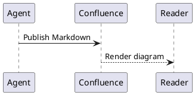

# confluence-wiki-md

Confluence를 Markdown 파일로 읽고 편집하는 Node.js CLI입니다. **Cloud REST v2/v1**과 **Data Center REST v1 + bearer PAT**를 지원하며, 에이전트는 `cfwiki`와 [스킬 하나](skills/confluence-wiki/SKILL.md)로 검색·읽기·쓰기 작업을 수행할 수 있습니다.

처음 설정한다면 **CLI 설치 → Cloud 또는 사내 PAT 설정 → 첫 문서 게시** 순서로 진행하세요.
도표가 필요하면 로컬 검사 도구와 Confluence 앱을 추가로 설치합니다.

- [설치](#설치)
- [Cloud 설정](#cloud-설정)
- [사내 Confluence / PAT](#사내-confluence--pat)
- [첫 문서 게시와 수정](#첫-문서-게시와-수정)
- [에이전트 스킬 설치](#에이전트-스킬-설치)
- [도표 자동 변환과 검사](#도표-자동-변환과-검사)
- [무료 Cloud 도표 앱 설치](#무료-cloud-도표-앱-설치)
- [매크로 설정값 확인](#매크로-설정값-확인)
- [검증 및 문제 해결](#검증)

## 설치

[Git](https://git-scm.com/downloads), [Node.js 24 이상과 npm](https://nodejs.org/en/download)이 필요합니다.
아래 설치 명령은 macOS/Linux 셸 기준입니다. 실제 Cloud 도표 왕복은 macOS에서 검증했습니다.
Node.js 설치 후 새 터미널에서 버전을 먼저 확인하세요.

```sh
git --version
node --version
npm --version
```

저장소를 복제하고 CLI를 설치합니다.

```sh
git clone https://github.com/TwoTwo-me/confluence-wiki-md.git
cd confluence-wiki-md
npm ci
npm link
cfwiki --help
cp -n .env.example .env
chmod 600 .env
```

`npm ci`는 잠금 파일의 버전으로 설치하며 Puppeteer의 Chrome 다운로드가 실행될 수 있습니다.
이미 Chrome이 있거나 일반 Markdown 기능만 쓴다면 `PUPPETEER_SKIP_DOWNLOAD=true npm ci`로
다운로드를 생략할 수 있습니다. Mermaid를 사용할 때는 아래 [로컬 검사 환경](#로컬-검사-환경)을 준비하세요.
브라우저 로그인은 CLI 실행 조건이 아닙니다. CLI는 `.env`의 토큰으로 인증합니다.

전역 연결 없이 `npm run -s confluence -- <명령>`으로도 실행할 수 있습니다.
`-s`는 npm의 안내 문구를 없애 stdout에 Markdown만 남깁니다.
현재 프로젝트는 공개 소스이며 npm 레지스트리에 배포하지 않습니다.

```sh
npm run -s confluence -- --help
# 저장소 밖에서는 CLI와 프로필의 절대 경로로도 실행할 수 있습니다.
node /path/to/confluence-wiki-md/scripts/confluence.mjs doctor --env /path/to/confluence-wiki-md/.env
```

`npm link`가 권한 오류로 실패하면 전역 연결 없이 위 명령을 사용하거나,
사용자 권한으로 설치한 Node.js 환경에서 다시 실행하세요.

## Cloud 설정

1. 사용할 Confluence 사이트에 로그인합니다. 새 테스트 환경은 [Confluence Cloud](https://www.atlassian.com/software/confluence)에서 만들 수 있습니다. 가입 화면에서 필요한 요금제를 직접 확인하세요.
2. 테스트용 공간을 만들고 **space key**를 확인합니다. 아래 예시에서는 `DOCS`를 사용합니다. 공간 이름이나 숫자 space ID와 구분하세요.
3. [API 토큰 관리](https://id.atlassian.com/manage-profile/security/api-tokens)에서 **Create API token with scopes**를 선택하고 이름·만료일·Confluence를 지정합니다. 본인 확인이 나오면 계정 이메일의 최신 인증코드로 진행합니다.
4. 아래 표의 권한을 선택해 토큰을 발급하고, 로컬 편집기로 `.env`의 `CONFLUENCE_API_TOKEN`에 저장합니다. 토큰은 생성 직후 한 번만 표시됩니다. [공식 토큰 발급 안내](https://support.atlassian.com/atlassian-account/docs/manage-api-tokens-for-your-atlassian-account/)
5. 브라우저에서 `https://your-site.atlassian.net/_edge/tenant_info`를 열어 `cloudId`를 확인하고 `.env`에 넣습니다.

설치 단계에서 만든 `.env`를 다음과 같이 채웁니다. 사이트 URL에는 `/wiki`를 붙이지 않습니다.

```dotenv
CONFLUENCE_DEPLOYMENT=cloud
CONFLUENCE_SITE_URL=https://your-site.atlassian.net
CONFLUENCE_EMAIL=you@example.com
CONFLUENCE_CLOUD_ID=00000000-0000-0000-0000-000000000000
CONFLUENCE_SPACE_KEY=DOCS
CONFLUENCE_API_TOKEN=발급받은_토큰
```

실제 Cloud ID는 사이트의 `/_edge/tenant_info`에서 확인합니다. 범위 지정 토큰은
`https://api.atlassian.com/ex/confluence/{cloudId}/wiki/api/v2`로 전송됩니다.
`CONFLUENCE_API_URL`을 명시하면 이 전체 API 주소를 직접 지정할 수 있습니다.
Cloud의 v1 경로는 자동으로 계산하며, 별도 게이트웨이는 `CONFLUENCE_API_V1_URL`로 지정합니다.

[Atlassian 토큰 설정](https://id.atlassian.com/manage-profile/security/api-tokens)에서 필요한 권한만 선택합니다.

| 기능 | granular scope |
| --- | --- |
| 공간 조회 | `read:space:confluence` |
| 페이지·메타데이터 읽기/쓰기 | `read:page:confluence`, `write:page:confluence` |
| 검색·첨부 API 상세 조회 | `read:content-details:confluence` |
| 첨부 읽기/쓰기 | `read:attachment:confluence`, `write:attachment:confluence` |
| 라벨 읽기/쓰기 | `read:label:confluence`, `write:label:confluence` |
| 도표 매크로 서버 미리보기 | `read:content.metadata:confluence` |
| 페이지 휴지통 이동 | `delete:page:confluence` |

토큰 범위와 별도로 계정에 공간·페이지 접근 권한이 있어야 합니다.
현재 기본 읽기는 라벨과 문서 메타데이터도 조회합니다.

연결을 확인합니다. 성공하면 `authenticated: true`와 설정한 공간 정보가 표시됩니다.

```sh
cfwiki doctor --env .env --json
```

## 사내 Confluence / PAT

회사 서비스가 Cloud인지 Data Center인지 먼저 확인하세요. PAT를 쓰는 설치형 Confluence라면
아래 프로필로 연결할 수 있습니다. 실제 사내 인스턴스의 버전과 확장 앱까지 호환된다는 뜻은 아닙니다.

사내 Confluence에서 **프로필 → 설정 → Personal access tokens → Create token**으로
토큰을 발급합니다. 메뉴가 없으면 관리자에게 서버 종류와 PAT 사용 정책을 확인하세요.
일반적인 PAT 지원은 Confluence 7.9 이상 기준입니다. [공식 PAT 안내](https://confluence.atlassian.com/enterprise/using-personal-access-tokens-1026032365.html)

Cloud 프로필과 별개로 `.env.company`를 만들고 다음 값만 넣습니다.
`CONFLUENCE_API_TOKEN`과 `CONFLUENCE_PAT`를 함께 넣지 마세요. 둘 다 있으면 API 토큰이 우선합니다.

```dotenv
CONFLUENCE_DEPLOYMENT=datacenter
CONFLUENCE_SITE_URL=https://wiki.company.example/confluence
CONFLUENCE_API_URL=https://wiki.company.example/confluence/rest/api
CONFLUENCE_AUTH=bearer
CONFLUENCE_PAT=발급받은_PAT
CONFLUENCE_SPACE_KEY=DOCS
```

`SITE_URL`에는 `/confluence` 같은 실제 컨텍스트 경로를 포함합니다.
PAT는 `Authorization: Bearer ...`로 전송하며 Cloud ID와 이메일은 필요 없습니다.
Basic 인증을 사용하는 서버는 `CONFLUENCE_AUTH=basic`, `CONFLUENCE_USERNAME`,
`CONFLUENCE_API_TOKEN`을 지정합니다.

```sh
chmod 600 .env.company
cfwiki doctor --env .env.company
cfwiki read 12345 --env .env.company
```

`--env`는 독립적인 연결 프로필입니다. 다른 프로필의 토큰이나 URL을 프로세스 환경에서
섞어 가져오지 않습니다. 옵션이 없으면 현재 디렉터리의 `.env`를 읽고 프로세스 환경 변수를 우선합니다.
사내 인증서는 `NODE_EXTRA_CA_CERTS`로 신뢰할 CA를 추가하세요. TLS 검증을 끄지 않습니다.
신뢰할 수 있는 HTTP 개발 서버에서만 `CONFLUENCE_ALLOW_HTTP=true`를 명시할 수 있습니다.

## 첫 문서 게시와 수정

도표 앱이 없어도 실행할 수 있는 [시작 예제](examples/getting-started.md)를 사용합니다.
아래 명령은 저장소 루트에서 실행하며, 실제 게시 시 설정된 공간에 페이지가 생성됩니다.

```sh
mkdir -p wiki
cp -n examples/getting-started.md wiki/getting-started.md
cfwiki validate wiki/getting-started.md
cfwiki upload wiki/getting-started.md --dry-run --env .env
cfwiki upload wiki/getting-started.md --env .env
```

성공하면 `wiki/getting-started.md`의 YAML에 `confluence.id`, `version`, `url`이 기록됩니다.
`url`을 열어 게시 결과를 확인하세요. 다음 예시의 `12345`를 그 ID로 바꿉니다.

```sh
cfwiki download 12345 -o wiki/getting-started-edit.md --env .env
# 편집기에서 getting-started-edit.md의 본문을 수정하고 저장합니다.
cfwiki validate wiki/getting-started-edit.md
cfwiki upload wiki/getting-started-edit.md --dry-run --env .env
cfwiki upload wiki/getting-started-edit.md --env .env
cfwiki read 12345 --env .env
```

수정 업로드는 같은 페이지 ID를 유지하고 버전을 올립니다. YAML의 ID·버전·해시를 직접 바꾸지 마세요.
그 이후에는 최신 버전이 담긴 `getting-started-edit.md`를 기준으로 작업합니다.
사내 프로필은 위 명령의 `--env .env`를 `--env .env.company`로 바꿉니다.

## 에이전트 스킬 설치

CLI 설치를 마친 뒤 저장소 루트에서 실행합니다. 기존 `confluence-wiki` 설치가 있으면 먼저 확인하세요.
심볼릭 링크는 이 저장소의 스킬 변경을 그대로 반영합니다.

```sh
mkdir -p "${CODEX_HOME:-$HOME/.codex}/skills"
ln -s "$(pwd)/skills/confluence-wiki" "${CODEX_HOME:-$HOME/.codex}/skills/confluence-wiki"
```

스킬 디렉터리를 다르게 사용하는 에이전트는 [skills/confluence-wiki](skills/confluence-wiki)를
해당 디렉터리에 복사합니다. 스킬에는 토큰을 넣지 않습니다. 에이전트가 다른 작업 폴더에서
실행되면 다음처럼 **프로필의 절대 경로**를 함께 전달하세요.

```text
$confluence-wiki를 사용해 "배포 절차"를 검색하고 Markdown으로 읽어줘.
연결 프로필은 /absolute/path/to/confluence-wiki-md/.env.company를 사용해.
```

브라우저 자동화나 별도 MCP 서버 없이 CLI와 스킬로 문서 작업을 수행할 수 있습니다.

## Markdown stdout과 파일

**읽기는 Markdown stdout, 편집은 .md 파일**을 기본 흐름으로 정했습니다.
에이전트가 내용을 확인할 때 임시 파일이 필요 없고, 수정할 때는 파일을 저장해 diff와 버전을 확인할 수 있습니다.

```sh
cfwiki search "배포 절차"
cfwiki read 12345
cfwiki read 12345 --body-only
cfwiki download 12345 -o wiki/deployment.md --assets
cfwiki validate wiki/deployment.md
cfwiki upload wiki/deployment.md --dry-run
cfwiki upload wiki/deployment.md
```

새 파일에는 `type`과 `title`을 넣고 `upload`합니다. 없는 front matter는 자동으로 보완합니다.
새 페이지 ID와 버전은 원본 파일에도 기록되므로 같은 파일을 다시 올리면 기존 페이지가 수정됩니다.
다운로드는 기존 파일을 덮어쓰지 않습니다. 필요할 때만 `--overwrite`를 명시하세요.

표준 입력도 지원합니다.

```sh
printf '# New guide\n\nA short document.\n' | cfwiki upload - --title "New guide" --space DOCS
```

stdin 업로드 결과에는 생성한 ID와 버전이 포함됩니다. 이후 편집할 계획이라면 결과를 파일로 보관하세요.
`--json`은 구조화된 결과, `--output/-o`는 결과 저장, `--version N`은 과거 페이지 읽기입니다.

## Google Open Knowledge Format

[Google OKF v0.2](https://github.com/GoogleCloudPlatform/open-knowledge-format/blob/main/SPEC.md)의
Markdown + YAML 구조를 사용합니다. 필수 `type`은 없을 때 `Reference`로 보완합니다.
권장 필드와 알 수 없는 사용자 필드도 보존합니다. 검증 상태나 출처를 임의로 생성하지 않습니다.

```yaml
---
type: Playbook
title: 배포 절차
description: 서비스 배포와 롤백 절차
tags: [operations]
sources:
  - id: source-a
    resource: https://example.com/reference
custom:
  owner: platform
confluence:
  deployment: datacenter
  api_url: https://wiki.company.example/confluence/rest/api
  site_url: https://wiki.company.example/confluence
  id: "12345"
  version: 7
  space: DOCS
  parent_id: "10000"
  url: https://wiki.company.example/confluence/pages/viewpage.action?pageId=12345
  labels: [operations]
---
```

요청한 **API URL / 페이지 고유 ID / 페이지 버전**은 각각 `api_url`, `id`, `version`입니다.
OKF의 concept ID는 번들 안의 파일 경로이며, Confluence 숫자 ID는 별도 메타데이터입니다.
`tags`는 OKF 메타데이터이고, `confluence.labels`가 원격 라벨을 명시적으로 동기화합니다.

사용자 YAML은 페이지의 `confluence-wiki-md` content property에 저장합니다.
브라우저에서 본문을 수정해도 사용자 YAML은 유지하고, 최신 원격 본문을 다시 변환합니다.
작은 문서는 원본 Markdown도 압축 저장해 불필요한 문법 변화를 줄입니다.
원격 이미지·페이지 URL로 치환한 문서는 저장 위치에 독립적인 Markdown으로 내려받습니다.

다운로드에 추가되는 `storage_hash`는 원격 본문 검증용이고, `preserved`는 네이티브 매크로의 원본 XML입니다.
수정 파일에서 이 필드를 유지하세요. 서로 다른 서버로 잘못 쓰지 않도록 파일의 URL과 현재 프로필을 비교하며,
front matter의 주소로 토큰을 전송하지 않습니다.

## 변환 범위

| 내용 | 업로드 / 다운로드 |
| --- | --- |
| 제목 1–6, 문단, 강조, 인라인 코드, 구분선, 줄바꿈, 인용, 목록 | Confluence storage ↔ Markdown |
| 표준 링크, 자동 링크, 참조 링크, 이미지 | Markdown 링크/이미지로 변환 |
| GFM 표, 취소선, 체크리스트, 각주 | storage 요소로 변환 |
| 코드 블록·들여쓴 코드 | 네이티브 code 매크로 ↔ fenced code |
| `mermaid`, `uml`, `plantuml` 코드블록 | 로컬 문법 검사 + 서버 미리보기 후 설정된 네이티브 매크로로 게시 |
| 그 외 코드 언어 | 언어를 보존한 code 매크로 |
| 기존 Mermaid/PlantUML 등 plain-text 매크로 | 언어 이름을 가진 코드 블록 |
| info/note/panel/expand 등 rich-text 매크로 | `confluence-이름` 코드 블록 |
| Jira, 동적 플러그인, 복잡한 병합 표, 변환 불가 요소 | 원본 페이지 또는 매크로 URL 링크 |
| 첨부 이미지 | 원격 URL 또는 `--assets`로 다운로드한 로컬 경로 |
| 로컬 `[문서](./other.md)` 및 `[문서](/path.md)` | 게시된 Confluence 페이지 링크로 변환 |

기존 매크로의 다운로드 표현을 수정하지 않으면 `preserved`를 사용해 원본을 복구합니다.
표현을 수정하면 해당 부분은 새 Markdown 변환 결과로 대체됩니다.
도표 코드블록은 서버에 설치된 앱의 매크로로 게시합니다. 매크로 설정이 없거나 검사가 실패하면 업로드를 중단합니다.
코드 자체를 표시하려면 `--diagrams code`를 명시하세요. 이미지 첨부로 자동 대체하지 않습니다.

## 도표 자동 변환과 검사

코드블록의 언어가 `mermaid`이면 Mermaid, `uml` 또는 `plantuml`이면 PlantUML로 검사합니다.
순서도·시퀀스·클래스 다이어그램 등의 예제는 [examples/diagrams.md](examples/diagrams.md)에 있습니다.
검사한 소스를 Confluence의 네이티브 매크로로 보내며, 실제 도표는 **Confluence 앱에서 렌더링**합니다.

### 로컬 검사 환경

| 기능 | 추가 도구 |
| --- | --- |
| 일반 Markdown CRUD | Node.js와 npm 의존성 |
| Mermaid 문법 검사 | Chrome 또는 Puppeteer가 설치한 Chrome |
| UML/PlantUML 문법 검사 | `plantuml` 실행 파일과 Java. 일부 도표용 Graphviz |
| 웹에서 도표 표시 | 대상 Confluence에 설치된 도표 앱과 아래 매크로 설정 |

macOS에서 [Homebrew](https://brew.sh/)를 쓰는 경우:

```sh
brew install plantuml
plantuml -version
# Google Chrome이 설치되지 않았다면 저장소 루트에서 실행합니다.
npx puppeteer browsers install chrome
cfwiki validate examples/diagrams.md
```

`brew install plantuml`은 필요한 Java·Graphviz 의존성도 설치합니다.
다른 운영체제는 [PlantUML 설치 안내](https://plantuml.com/starting)를 따라 `plantuml` 명령이
실행되도록 준비하세요. CLI의 `CFWIKI_PLANTUML_PATH`에는 JAR 파일 대신 실행 가능한 명령 경로를 넣습니다.
Chrome 다운로드에 관한 세부 설정은 [Puppeteer 공식 안내](https://pptr.dev/guides/configuration)를 참고하세요.

macOS에서는 설치된 Google Chrome을 기본으로 찾습니다. 다른 위치의 브라우저는
`CFWIKI_CHROME_PATH`, PlantUML 실행 파일은 `CFWIKI_PLANTUML_PATH`로 지정할 수 있습니다.
Linux/Windows에서 기존 Chrome을 쓰거나 캐시 경로가 다른 경우 `.env`에 실행 파일의 절대 경로를 지정하세요.

```dotenv
CFWIKI_CHROME_PATH="/absolute/path/to/chrome"
CFWIKI_PLANTUML_PATH="/absolute/path/to/plantuml"
```

기본 경로에서 정상 동작한다면 위 두 항목은 추가하지 않습니다.
사용자의 브라우저 로그인 프로필을 사용하지 않고 임시 프로필에서 검사합니다.
도표 원문은 외부 공개 렌더링 서비스로 전송하지 않습니다.
PlantUML은 SANDBOX 모드로 실행하여 파일/URL include를 차단합니다.

### 기존 매크로 앱 설정

연결 프로필에는 **해당 서버에 설치된 앱의 실제 storage macro 이름**을 지정해야 합니다.
아래 이름은 예시이며 모든 Confluence에서 통용되는 이름은 아닙니다.

```dotenv
CONFLUENCE_MERMAID_MACRO=mermaid
CONFLUENCE_PLANTUML_MACRO=plantuml
```

기본은 `ac:plain-text-body`에 코드를 담습니다. 앱이 `ac:parameter`로 코드를 받으면
예를 들어 `CONFLUENCE_PLANTUML_SOURCE_PARAMETER=source`를 지정합니다.
앱별 추가 설정은 `CONFLUENCE_MERMAID_PARAMETERS={"theme":"default"}`처럼 JSON 문자열로 지정합니다.
매크로 이름과 파라미터는 앱 문서 또는 그 앱으로 작성한 페이지의 storage 본문에서 확인하세요.
Cloud Forge 앱은 `ac:adf-extension` 형식으로 연결합니다. 본문 소스를 단일 문자열 설정에
저장하는 앱은 `forge` 어댑터로 지원합니다. `FORGE_EXTENSION_KEY`는 앱에서 직접 만든
페이지의 storage 본문에 있는 `extension-key` 값이며, 앱 ID·환경 ID·모듈 키를 포함합니다.
다른 서버의 값을 추측해서 복사하지 마세요.

## 무료 Cloud 도표 앱 설치

2026-09-22 기준 아래 두 앱의 무료 설치와 실제 페이지 렌더링을 확인했습니다.
설치하려는 사이트의 관리자 계정으로 진행하고, 현재 설치 화면에서도 무료 조건을 확인하세요.

| 앱 | 어댑터 | 소스 저장 방식 |
| --- | --- | --- |
| [Mermaid diagrams viewer — Atlassian Labs](https://marketplace.atlassian.com/apps/1232887/mermaid-diagrams-viewer) | `mermaid-viewer` | 코드블록과 Forge 뷰어 매크로. CLI가 코드블록 번호를 자동 연결 |
| [PlantUML for Confluence Cloud — Narva](https://marketplace.atlassian.com/apps/2183031251/plantuml-for-confluence-cloud) | `forge` | `diagram-code` 설정에 PlantUML 원문 저장 |

1. 표의 Marketplace 링크를 열고 **Get it now**를 선택합니다.
2. 설치할 **Confluence 사이트**를 선택합니다. **Review and install**에서 앱 이름, `Free` 표시, 요청 권한을 확인하고 설치합니다.
3. Confluence의 **Apps → Manage apps** 또는 관리 화면의 **Connected apps → Installed apps**에서 두 앱의 설치 완료를 확인합니다. [공식 앱 관리 안내](https://support.atlassian.com/confluence-cloud/docs/manage-your-apps/)
4. 테스트 공간에 새 페이지를 만들고 일반 **코드블록**에 `flowchart LR`와 다음 줄 `Markdown --> Confluence`를 입력합니다. 코드블록 밖에서 `/mermaid`로 **Mermaid diagram**을 넣고 방금 만든 코드블록을 선택합니다.
5. 같은 페이지에서 `/plantuml`로 **PlantUML Diagrams**를 넣습니다. **PlantUML Source**에 아래 예제를 붙여 넣고 **Save Diagram**을 선택합니다.
6. 페이지를 게시하고 두 도표가 보이는지 확인합니다. 페이지 URL의 숫자 ID를 다음 절차에 사용합니다.



이 앱들은 Cloud용입니다. 사내 Data Center에는 설치된 앱의 문서와 앞의 기존 매크로 설정을 사용하세요.

### 매크로 설정값 확인

매크로 키는 앱의 표시 이름과 다릅니다. 방금 웹에서 만든 테스트 페이지를 조회합니다.
아래 `12345`를 실제 ID로 바꾸세요. 이 작업은 페이지를 변경하지 않습니다.

```sh
cfwiki read 12345 --json -o artifacts/macro-probe.json --env .env
```

아래 명령은 저장된 원본 XML에서 **앱 키와 설정 필드 이름만** 출력합니다.
토큰이나 도표 본문을 출력하지 않으며, `node_modules`가 있는 저장소 루트에서 실행합니다.

```sh
node --input-type=module -e '
import { readFile } from "node:fs/promises";
import { load } from "cheerio";
const doc = JSON.parse(await readFile("artifacts/macro-probe.json", "utf8"));
for (const fragment of doc.metadata.confluence.preserved ?? []) {
  const $ = load(fragment.storage, { xmlMode: true });
  $("ac\\:adf-extension > ac\\:adf-node").each((_, node) => {
    const fields = $(node).children("[key=parameters]").children("[key=guest-params]");
    console.log(JSON.stringify({
      extensionKey: $(node).children("[key=extension-key]").text(),
      title: $(node).children("[key=text]").text(),
      parameters: fields.children().map((_, field) => $(field).attr("key")).get()
    }, null, 2));
  });
}
'
```

출력된 `extensionKey`를 아래 `<app-id>/<environment-id>/static/...` **전체 값 대신** 넣습니다.
두 앱의 키를 구분해서 기존 `.env`에 추가합니다. 인증 설정은 그대로 유지합니다.

```dotenv
CONFLUENCE_MERMAID_MACRO=mermaid-diagram
CONFLUENCE_MERMAID_ADAPTER=mermaid-viewer
CONFLUENCE_MERMAID_FORGE_EXTENSION_KEY=<app-id>/<environment-id>/static/mermaid-diagram
CONFLUENCE_MERMAID_TITLE=Mermaid diagram

CONFLUENCE_PLANTUML_MACRO=plantuml-confluence
CONFLUENCE_PLANTUML_ADAPTER=forge
CONFLUENCE_PLANTUML_FORGE_EXTENSION_KEY=<app-id>/<environment-id>/static/plantuml-confluence
CONFLUENCE_PLANTUML_SOURCE_PARAMETER=diagram-code
CONFLUENCE_PLANTUML_TITLE=PlantUML Diagrams
```

Mermaid viewer는 웹에 소스 코드블록도 함께 표시합니다. 다운로드할 때 소스와 뷰어를
하나의 `mermaid` 코드블록으로 합칩니다. CLI 업로드는 일반 코드블록이 섞여 있어도
각 뷰어의 번호를 지정하며, 동일한 소스를 반복해도 매크로 식별자는 겹치지 않습니다.
웹에서 작성한 뷰어는 명시된 코드블록 번호를 사용합니다. 자동 감지는 모든 코드블록과
뷰어가 일대일로 인접한 경우에만 복원하며, 불명확하면 매크로 URL과 원문을 보존합니다.
등록되지 않은 Forge 앱도 URL과 전체 XML을 보존합니다.
앱이 별도 파일·외부 저장소·복잡한 JSON 설정을 사용한다면 해당 방식의 추가 연결이 필요합니다.
사내 Data Center의 기존 `ac:structured-macro` 앱은 앞의 기본 설정을 사용합니다.

### 도표 업로드와 왕복 확인

예제를 `wiki/`로 복사해 사용하면 원본 예제 파일에 개인 사이트의 ID가 기록되지 않습니다.

```sh
mkdir -p wiki
cp -n examples/diagrams.md wiki/diagrams.md
cfwiki validate wiki/diagrams.md
cfwiki validate wiki/diagrams.md --server --env .env
cfwiki upload wiki/diagrams.md --dry-run --env .env
cfwiki upload wiki/diagrams.md --env .env
# 아래 ID를 wiki/diagrams.md에 기록된 confluence.id로 바꿉니다.
cfwiki download 12345 -o wiki/diagrams-edit.md --env .env
# diagrams-edit.md의 도표 소스를 수정한 뒤 실행합니다.
cfwiki upload wiki/diagrams-edit.md --env .env
```

첫 게시와 수정 게시 후 모두 `confluence.url`을 열어 **그림 안의 문구**가 바뀌었는지 확인하세요.
사내 연결은 `.env` 대신 `.env.company`를 지정합니다.

로컬 `validate`에는 API 토큰과 매크로 설정이 필요 없습니다.
검사 결과에는 엔진 버전과 Markdown 줄 번호가 나오며 문법 오류는 해당 위치와 함께 반환됩니다.
`--server`와 업로드는 Confluence의 content-body 변환 API도 호출합니다. 페이지 저장은 하지 않는 미리보기이며,
HTTP 200 응답 안의 알 수 없는 매크로 오류도 실패로 처리합니다.
`push`는 모든 문서의 도표를 검사한 뒤 새 페이지를 생성합니다.

**Confluence 전체에 공통인 단일 도표 문법 검사기는 없습니다.** 서버 앱의 엔진 버전이 로컬과 다를 수 있습니다.
특히 iframe으로 렌더링하는 앱은 미리보기 API가 HTML 껍데기만 반환할 수 있으므로,
API가 수락했다고 실제 그림 표시까지 검증된 것은 아닙니다. 새 앱 연결 시 웹에서도 확인하세요.
매크로를 재생성할 때는 연결 프로필의 파라미터를 적용합니다.
문서 하나당 최대 100개 도표, 도표 하나당 최대 50 KB를 검사하며, 프로세스 실행 시간을 제한합니다.

모든 Confluence 앱의 렌더링을 Markdown으로 완전히 재현할 수는 없습니다.
페이지 레이아웃은 읽기 순서로 평탄화하고, 색·폰트·일부 표 스타일 등 표현 정보는 정규화됩니다.
동적 결과, 댓글, 권한 설정, 변경 이력 전체를 복제하는 백업 도구는 아닙니다.
과거 버전 읽기는 해당 본문을 가져오며 라벨/첨부 전체의 과거 스냅샷을 재구성하지 않습니다.
YAML 사용자 메타데이터는 약 28 KB, 원격 content property는 30 KB 이내로 제한합니다.

## LLM wiki 번들

```sh
cfwiki list --space DOCS
cfwiki export wiki --space DOCS
cfwiki search "rollback" --local wiki
cfwiki push wiki --space DOCS
```

내보내기는 `index.md`와 `pages/<page-id>.md`를 만듭니다.
번들 내부 링크는 상대 Markdown 링크로 바꿉니다. 기본 최대 1,000개이며 `--limit`으로 조절합니다.
`--parent ID`는 직계 하위 페이지만 조회합니다.
`index.md`와 `log.md`는 OKF 예약 파일로, push 대상에서 제외합니다.
push는 새 페이지 ID를 먼저 할당한 후 문서 사이의 링크를 연결하므로 순환 링크도 처리합니다.
기존 ID가 포함된 번들을 다른 사이트에 그대로 게시하는 것은 차단합니다.

로컬 이미지 참조는 파일이 있는 폴더 또는 명시한 `--root` 안에서만 읽습니다.
심볼릭 링크를 통한 루트 이탈도 차단합니다. 이미지 이외의 첨부는 아래 명령으로 지정합니다.

```sh
cfwiki attachments list 12345
cfwiki attachments upload 12345 ./design.pdf
cfwiki attachments download 12345 67890 -o files/design.pdf
```

## 삭제와 충돌

```sh
cfwiki delete wiki/deployment.md --yes
cfwiki delete 12345 --version 7 --yes
```

삭제는 휴지통 이동이며 영구 삭제를 하지 않습니다.
휴지통 문서도 권한에 따라 읽힐 수 있으며 `confluence.status: trashed`로 표시됩니다.
업로드는 현재 버전을 확인하고 서버에 다음 버전을 보내므로 동시 편집 충돌을 차단합니다.
삭제도 직전에 버전을 확인하지만 서버 삭제 API가 버전 조건을 지원하지 않아 검사와 삭제 사이의 경쟁은 남습니다.

페이지·첨부·라벨·property 저장과 번들 push는 하나의 트랜잭션이 아닙니다.
중간 실패 시 이미 저장된 페이지 ID/버전은 로컬 파일에 기록하고 오류로 알립니다.
상태를 확인한 뒤 같은 파일로 이어서 작업하세요. 전체 번들을 자동으로 롤백하지 않습니다.
오류 후 원본 파일의 ID를 지워 재시도하면 중복 페이지가 생성될 수 있습니다.
자동 쓰기 재시도는 하지 않습니다.

## 검증

```sh
npm test
npm run test:diagrams
npm run -s test:live
```

`npm test`는 인증 정보 없이 변환, Cloud API 요청 형식, Data Center PAT HTTP 계약,
실제 CLI CRUD, 버전 충돌, 프로필 격리, 경로 제한, 번들 링크, 비밀값 비노출을 검증합니다.

`test:diagrams`는 실제 로컬 엔진으로 정상/오류 문법과 업로드 전 차단을 검사하며 Chrome·PlantUML이 필요합니다.
`test:live`는 도표 앱 없는 환경에서도 일반 CRUD를 확인하도록 `--diagrams code`를 명시합니다.
현재 `.env`의 공간에 예제 페이지를 생성하고 Markdown 다운로드,
이미지 바이트 일치, 수정, 충돌, 검색, 내보내기, 임시 페이지 휴지통 이동을 실행합니다.
결과 예제 페이지는 남기고 `artifacts/live-test.json`에 기록합니다.
검색 인덱스 반영 지연 등으로 중단되면 `npm run -s test:live -- artifacts/live-실행번호`로 같은 예제를 이어서 검증할 수 있습니다.
테스트 계정·공간에서 실행하세요. 사내 실제 환경 검증은 해당 인스턴스에 연결해야 합니다.

기존 `smoke` 명령은 Cloud 연결 검증용으로 유지합니다. 저장된 개발 테스트 페이지를 갱신하고 JSON을 출력합니다.
일반 문서 작업에는 `upload/read/download`를 사용하세요.

`.env*`, `artifacts/`, `wiki/`, 로컬 개발 상태와 토큰은 Git에서 제외합니다.
다운로드한 사내 문서를 다른 경로에 저장하면 그 경로도 직접 제외해야 합니다.
오류는 토큰과 서버 원문 응답을 출력하지 않습니다.

| 오류 | 대응 |
| --- | --- |
| `cfwiki: command not found` | 저장소에서 `npm link` 실행 또는 `npm run -s confluence -- ...` 사용 |
| Node 버전/모듈 오류 | `node --version`이 24 이상인지 확인하고 저장소에서 `npm ci` 실행 |
| `Missing CONFLUENCE_SITE_URL` | 현재 작업 폴더의 `.env` 또는 `--env /absolute/path/profile.env` 확인 |
| `PlantUML executable is unavailable` | `plantuml -version` 확인 후 실행 파일을 `CFWIKI_PLANTUML_PATH`로 지정 |
| Chrome 실행 파일 없음 | `npx puppeteer browsers install chrome` 실행 또는 `CFWIKI_CHROME_PATH` 지정 |
| 매크로 설정 누락/서버 미리보기 거절 | 대상 사이트의 앱 설치 여부, 매크로 이름, Forge 키, 소스 파라미터 확인 |
| 미리보기는 통과했지만 웹 도표 오류 | 앱의 실제 렌더링·코드블록 선택·지원 문법 확인. 로컬 엔진과 앱 버전이 다를 수 있음 |
| 401 / 403 | 토큰 만료, scope, 계정 권한 확인 |
| 404 | ID, 사이트, 공간과 접근 권한 확인 |
| 버전 충돌 / 409 | 최신 문서를 다운로드하고 변경 병합 |
| 429 | 서버 제한이 해제된 뒤 상태 확인 후 재시도 |
| 일부 동기화 실패 | 기록된 페이지 ID/버전으로 저장 상태 확인 |

## 업데이트와 설치 해제

저장소 루트에서 업데이트합니다. 작업 중인 코드가 있으면 먼저 변경사항을 확인하세요.

```sh
git pull --ff-only
npm ci
npm link
```

CLI의 전역 연결만 해제하려면 저장소 루트에서 `npm unlink --global confluence-wiki-md`를 실행합니다.
에이전트 스킬은 설치한 스킬 디렉터리의 링크를 제거합니다. Confluence 앱은
**Connected apps**에서 별도로 제거하며, CLI 연결 해제만으로 원격 페이지나 앱이 삭제되지는 않습니다.

## 공식 자료

- [Google Open Knowledge Format](https://github.com/GoogleCloudPlatform/open-knowledge-format)
- [Cloud 페이지 API](https://developer.atlassian.com/cloud/confluence/rest/v2/api-group-page/)
- [Cloud 첨부 API](https://developer.atlassian.com/cloud/confluence/rest/v1/api-group-content---attachments/)
- [Data Center REST API](https://developer.atlassian.com/server/confluence/rest/)
- [Data Center PAT](https://confluence.atlassian.com/enterprise/using-personal-access-tokens-1026032365.html)
- [Mermaid API](https://mermaid.js.org/config/usage.html)
- [PlantUML 명령행 검사](https://plantuml.com/command-line)
- [Confluence Cloud 서버 미리보기 API](https://developer.atlassian.com/cloud/confluence/rest/v1/api-group-content-body/)
