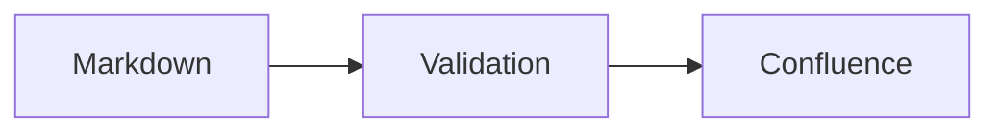
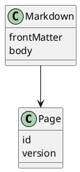

# Diagrams

## Mermaid



## UML sequence

```uml
@startuml
Agent -> CLI: Upload Markdown
CLI -> CLI: Validate syntax
CLI -> Confluence: Publish native macro
Confluence --> Reader: Render diagram
@enduml
```

## PlantUML class diagram


