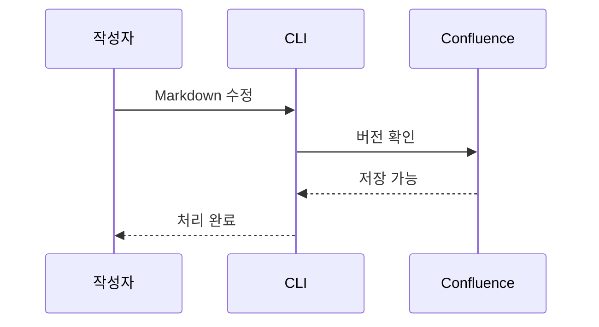
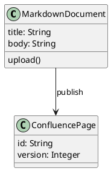

# Markdown 기능 비교

## 제목과 문단

### 3단계 제목

#### 4단계 제목

##### 5단계 제목

###### 6단계 제목

Setext 제목
-----------

첫 문단은 **굵게**, *기울임*, ***굵은 기울임***, ~~취소선~~, `인라인 코드`를 포함한다.

이스케이프: \*별표 그대로\*, \[대괄호 그대로\], A &amp; B, 2 &lt; 3.
HTML 인라인 표현: H<sub>2</sub>O, x<sup>2</sup>.

강제 줄바꿈 첫 줄.\
강제 줄바꿈 둘째 줄.

## 목록과 인용

- 첫 번째 항목
  - 중첩 항목 하나
  - 중첩 항목 둘
- 두 번째 항목

3. 세 번째부터 시작
4. 네 번째 항목

- [x] 작성 완료
- [ ] 검토 대기

> 인용문 첫 문단.
>
> 인용문 둘째 문단에는 **강조**가 있다.
>
> > 중첩 인용문.

## 표와 링크

| 왼쪽 | 가운데 | 오른쪽 |
| :--- | :---: | ---: |
| **굵게** | `코드` | 123 |
| 파이프 \| 문자 | *기울임* | 456 |
| [페이지 링크](https://example.atlassian.net/wiki/pages/viewpage.action?pageId=12345) | 줄 하나<br>줄 둘 | 789 |

[괄호 포함 링크](https://example.com/a_(b)?x=1&y=2 "링크 제목")

[참조식 링크][reference]와 <https://example.com> 자동 링크, <qa@example.com> 메일 링크.

[문서 내부 이동](#AnchorTarget)

[reference]: https://example.com/reference "참조 제목"

## 코드와 각주

```javascript
const text = "<tag> & ]]>";
console.log(text);
```

````text
세 개의 백틱을 코드 안에 표시한다.
```javascript
console.log("nested fence text");
```
````

    들여쓰기 코드
    공백과 줄바꿈을 유지한다.

각주 참조 하나.[^source]

[^source]: 각주 본문과 [출처 링크](https://example.com/source).

## Mermaid 흐름도


## Mermaid 시퀀스



## UML 시퀀스

```uml
@startuml
actor 작성자 as Author
participant CLI
participant Confluence
Author -> CLI: 문서 저장
CLI -> Confluence: 버전 검사
Confluence --> CLI: 저장 완료
CLI --> Author: 새 버전
@enduml
```

## PlantUML 클래스



## AnchorTarget

내부 링크의 도착 지점이다.


---

비교 상태: 수정 전.
