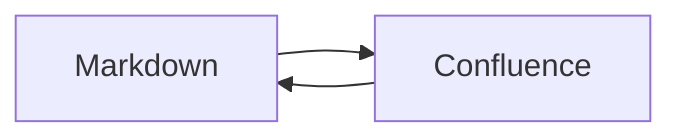

# Markdown wiki reference

한글 문서와 **bold**, *italic*, ~~strikethrough~~, `inline code`를 지원합니다.

## Links

[Open Knowledge Format](https://github.com/GoogleCloudPlatform/open-knowledge-format)
and [a URL with parentheses](https://example.com/path_(example)?a=1&b=2).

An automatic link: <https://example.com>.

## Lists and quotations

1. Download Markdown.
2. Edit locally.
   - Keep the page ID and version.
   - Upload the edited document.

- [x] Create
- [x] Read
- [ ] Update

> A quotation with **formatting**.
>
> A second paragraph.

### Table

| Operation | Input | Output |
| :--- | :---: | ---: |
| Read | Page ID | Markdown |
| Write | Markdown | Page version |

Line one with a hard break.\
Line two.

---

## Code

```javascript
const message = "Markdown → Confluence → Markdown";

console.log(message);
```



    Indented code also works.

## Image


## Footnotes

Metadata follows the Open Knowledge Format.[^okf]

[^okf]: See the source linked in the YAML front matter.

#### Heading four

Escaped punctuation: \*literal asterisks\*.

##### Heading five

###### Heading six
